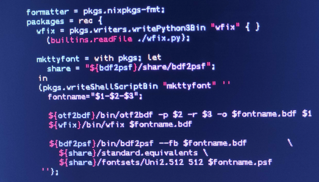

# TTF to TTY



## How to run

> `nix run github:Sigmanificient/ttf_to_tty [font.ttf] [size] [dpi]`
Or, wihtin the repo `nix run . [font.ttf] [size] [dpi]`

You'll need to adjust the `size` & `dpi` parameter to get the best of your font.
Good result can be achieve within the 10-18 point size with 80-160 dpi.

> Example:

```sh
nix run . APLMono.ttf 10 80
```

> **Note**:
> You may have a lot of warning due to missing glyphs.

> **Note**:
> The script will create 2 font files, but only the `.psf` one will be useful to you.

## Set your font

Use the following command to set the font on the tty.

```sh
setfont [font.psf]
```

> **Note**: You can use `-d` to double the font size.

If you need to reset your font back to the default simply type `setfont` without additional arguments.
